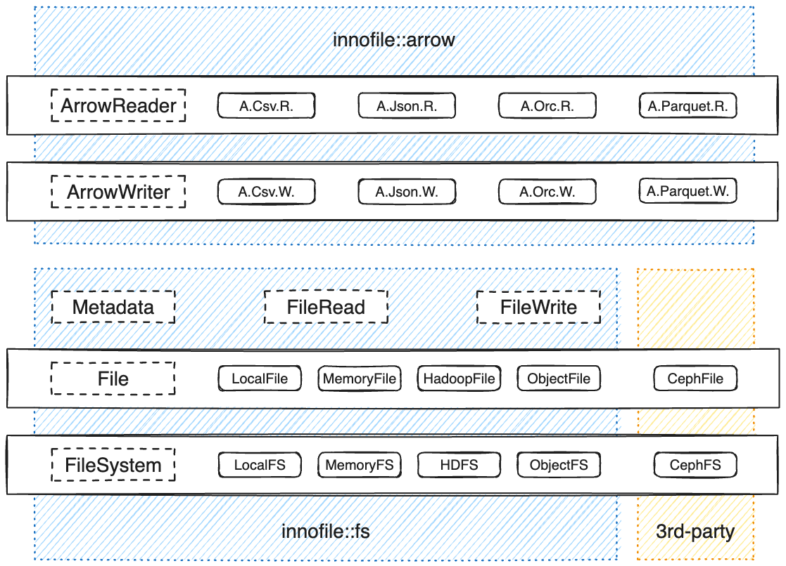

# InnoFile

> A simple interface to **read / write** data in **multiple file formats** on **multiple file systems**.

## Architecture



## Runtimes

| Runtime | Feature |
| ------- | ------- |
| Sync    | `sync`  |
| Tokio   | `tokio` |

## File Systems

> File systems are supported by implementing `FileSystem` trait.

| File System | Schemes           | Feature | Sync API | Tokio API |
| ----------- | ----------------- | ------- | -------- | --------- |
| LocalFS     | file, [no scheme] |         | ✅       | ✅        |
| MemoryFS    | memory            |         | ⬜       | ⬜        |
| HDFS        | hdfs, viewfs      | `hdfs`  | ⬜       | ⬜        |
| ObjectFS    | s3, s3a           | `s3`    | ✅       | ✅        |

## File Formats for Arrow Reader and Writer

> File formats are supported by implementing `ArrowReader` and `ArrowWriter` traits.

| File Format | Extensions         | Feature   | Sync API   | Tokio API  |
| ----------- | ------------------ | --------- | ---------- | ---------- |
| CSV         | csv, dsv, psv, tsv | `csv`     | ✅ R, ✅ W | ⬜ R, ⬜ W |
| JSON        | json               | `json`    | ✅ R, ✅ W | ⬜ R, ⬜ W |
| ORC         | orc                | `orc`     | ✅ R, ✅ W | ✅ R, ⬜ W |
| Parquet     | parquet            | `parquet` | ✅ R, ✅ W | ✅ R, ✅ W |

## CLI Tool

```shell
% cargo install innofile

% innofile --help
InnoFile

Usage: innofile <COMMAND>

Commands:
  convert   Convert files between supported formats
  generate  Generate files based on example file
  help      Print this message or the help of the given subcommand(s)

Options:
  -h, --help     Print help
  -V, --version  Print version
```

## Examples

### Read / write ORC file with Sync API

```rust
use std::sync::Arc;

use arrow::array::RecordBatch;
#[cfg(all(feature = "sync", feature = "orc"))]
use innofile::{
    arrow::{ArrowReaderBuilder, ArrowWriterBuilder},
    error::InnoFileResult,
    fs::FileSystemBuilder,
    io::SyncCloseable as _,
};

#[cfg(all(feature = "sync", feature = "orc"))]
fn main() -> InnoFileResult<()> {
    // prepare Arrow batch to write
    let batch: RecordBatch = todo!();
    // specify path to write with file extension
    let path = "/tmp/innofile_tmp/test_sync_api.orc";

    let file_system = FileSystemBuilder::from_path(path)?.build_sync()?;

    let file = Arc::from(file_system.create(path)?);
    let mut arrow_writer = ArrowWriterBuilder::new(batch.schema()).build_sync(file)?;
    arrow_writer.write(&batch)?;
    arrow_writer.close()?;

    let file = Arc::from(file_system.open(path)?);
    let mut arrow_reader = ArrowReaderBuilder::new().build_sync(file)?;
    while let Some(record_batch) = arrow_reader.next() {
        println!("record_batch num_rows = {}", record_batch?.num_rows());
    }

    Ok(())
}
```

### Read / write Parquet file with Tokio API

```rust
use std::sync::Arc;

use arrow::array::RecordBatch;
use futures::StreamExt as _;
#[cfg(all(feature = "tokio", feature = "parquet"))]
use innofile::{
    arrow::{ArrowReaderBuilder, ArrowWriterBuilder},
    error::InnoFileResult,
    fs::FileSystemBuilder,
    io::AsyncCloseable as _,
};

#[cfg(all(feature = "tokio", feature = "parquet"))]
#[tokio::main]
async fn main() -> InnoFileResult<()> {
    // prepare Arrow batch to write
    let batch: RecordBatch = todo!();
    // specify path to write with file extension
    let path = "/tmp/innofile_tmp/test_tokio_api.parquet";

    let file_system = FileSystemBuilder::from_path(path)?.build_async().await?;

    let file = Arc::from(file_system.create(path).await?);
    let mut arrow_writer = ArrowWriterBuilder::new(batch.schema())
        .build_async(file)
        .await?;
    arrow_writer.write(&batch).await?;
    arrow_writer.close().await?;

    let file = Arc::from(file_system.open(path).await?);
    let mut arrow_reader = ArrowReaderBuilder::new().build_async(file).await?;
    while let Some(record_batch) = arrow_reader.next().await {
        println!("record_batch num_rows = {}", record_batch?.num_rows());
    }

    Ok(())
}
```

### Generate and convert files in multiple formats with CLI

```shell
# prepare testing directory
% rm -rf innofile_tmp && mkdir -p innofile_tmp && cd innofile_tmp

# create example.csv
% echo "id,name,amount,paid\n1,Alex,100.0,true" >example.csv

% cat example.csv
id,name,amount,paid
1,Alex,100.0,true

# generate files based on example.csv
% innofile generate --example example.csv --size 10 out.csv out.dsv out.psv out.tsv out.json out.orc out.parquet

# convert out.orc to json format
% innofile convert --from out.orc --to out.orc.json

% diff out.json out.orc.json && echo 'same'
same

# convert out.parquet to tsv format
% innofile convert --from out.parquet --to out.parquet.tsv

% diff out.tsv out.parquet.tsv && echo 'same'
same
```

## License

Licensed under either of

- Apache License, Version 2.0
  ([LICENSE-APACHE](LICENSE-APACHE) or http://www.apache.org/licenses/LICENSE-2.0)
- MIT license
  ([LICENSE-MIT](LICENSE-MIT) or http://opensource.org/licenses/MIT)

at your option.

## Contribution

Unless you explicitly state otherwise, any contribution intentionally submitted
for inclusion in the work by you, as defined in the Apache-2.0 license, shall be
dual licensed as above, without any additional terms or conditions.
